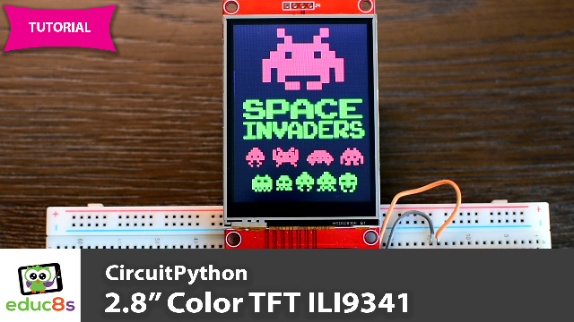

# CircuitPython ILI9341 Examples

Description.

  

# Full Instructions Video

Watch the video here: https://youtu.be/RtQqXMeYpqI

# Parts Needed

The parts needed in order to build this project are the following:

🛒  Raspberry Pi Pico: http://educ8s.tv/part/RaspberryPiPico

🛒  Display: http://educ8s.tv/part/28ILI9341
